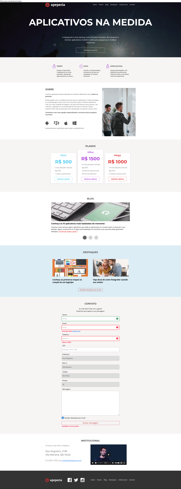

# acessibilidade-web-front-end
projeto de um site web com todas regras necessárias para pessoas deficientes visuais possam navegar pelo site de forma continua e sem nenhum problema de entendimento ao usar os programas de voz como jaws, voiceover, narrator, linux universal access
HTML5 e CSS3
 
